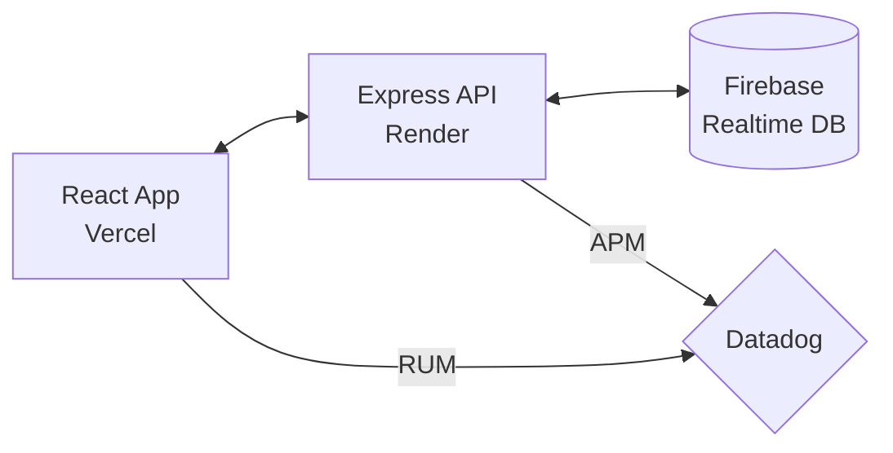

# Interactive 3D Portfolio - Monorepo

    

A professional full-stack portfolio featuring an interactive 3D environment, AI-driven chat integration, and enterprise-grade monitoring.

[Live Demo](#live-deployment) • [API Health](http://localhost:3000/health) • [Documentation](./DEPLOYMENT_GUIDE.md)

---

## 🌐 Live Deployment

| Service | Platform | URL |
| :--- | :--- | :--- |
| **Frontend** | Vercel | `portfolio-3d-index.vercel.app` |
| **Backend API** | Render | `portfolio-backend.onrender.com` |
| **Database** | Firebase | `Realtime Database` |

---

## 🌟 Features

### 🎨 Core Experience
* **Interactive 3D Environment** - Immersive portfolio built with Three.js and React Three Fiber
- **Framer Motion Animations** - Smooth transitions and engaging UI interactions
- **Responsive Design** - Optimized for all screen sizes from mobile to desktop

### 🤖 AI & Intelligence
- **Gemini AI Chatbot** - Integrated AI assistant for answering professional queries
- **Intelligent Context** - Chatbot aware of portfolio content and professional background

### 🔐 Authentication & Security
- **Admin Panel** - Secure dashboard for managing messages and content
- **Protected Routes** - Firebase-powered authentication for admin access
- **Secure API** - Backend-mediated database access to prevent credential exposure

### 📊 Monitoring & Data
- **Datadog APM** - Real-time backend tracing and performance monitoring
- **Datadog RUM** - Real-user monitoring for frontend session tracking
- **Centralized Logging** - Unified log management for rapid debugging

---

## 🏗️ Architecture



---

## 📂 Project Structure

```text
Daniel-Portfolio/
├── backend/                # Express.js Application
│   ├── src/
│   │   ├── firebase.ts     # Firebase Admin SDK setup
│   │   └── server.ts       # Main API entry point
│   ├── package.json        # Backend dependencies
│   ├── render.yaml         # Render deployment config
│   └── tsconfig.json       # TS configuration
├── frontend/               # React Application
│   ├── src/
│   │   ├── components/     # UI & 3D components
│   │   └── lib/            # Utilities & API clients
│   ├── package.json        # Frontend dependencies
│   ├── vercel.json         # Vercel deployment config
│   └── vite.config.ts      # Vite configuration
└── .gitignore              # Root git ignore
```

---

## 🔧 Environment Variables

### 📱 Frontend (`/frontend/.env`)
```env
VITE_API_BASE_URL=http://localhost:3000
VITE_GEMINI_API_KEY=your_gemini_key
VITE_ADMIN_PASSWORD=your_secure_password
VITE_DATADOG_APPLICATION_ID=your_id
VITE_DATADOG_CLIENT_TOKEN=your_token
```

### ⚙️ Backend (`/backend/.env`)
```env
NODE_ENV=development
PORT=3000
DATADOG_API_KEY=your_datadog_key
DATADOG_SERVICE=portfolio-backend
DD_TRACE_ENABLED=true
FIREBASE_DATABASE_URL=your_firebase_url
```

---

## 🚀 Quick Start

### 1. Clone & Install
```bash
git clone https://github.com/d3005/Daniel-Portfolio.git
cd Daniel-Portfolio
```

### 2. Launch Backend
```bash
cd backend
npm install
npm run dev
```

### 3. Launch Frontend
```bash
cd frontend
npm install
npm run dev
```

---

## 📄 License
Distributed under the **MIT License**.
