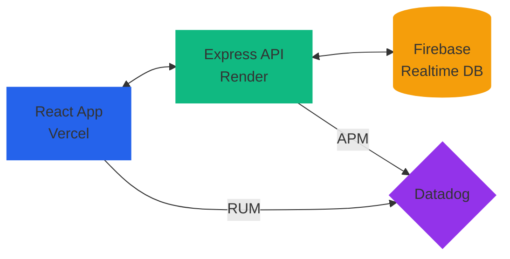

# Daniel Joseph Kommu's 3D Interactive Portfolio

      

A professional full-stack portfolio featuring an interactive 3D environment, AI-driven chat integration, and enterprise-grade monitoring, deployed with modern cloud infrastructure.

[Live Demo](#live-deployment) • [API Health](https://daniel-portfolio-udhf.onrender.com/health) • [Admin Panel](https://www.daniel-portfolio.in/admin) • [Documentation](./DEPLOYMENT_GUIDE.md)

---

## 🌐 Live Deployment

| Service | Platform | URL |
| :--- | :--- | :--- |
| **Frontend** | Vercel | `https://www.daniel-portfolio.in` |
| **Backend API** | Render | `https://daniel-portfolio-udhf.onrender.com` |
| **Database** | Firebase | `Realtime Database` |

---

## 🌟 Features

### 🎨 Core Experience
* **Interactive 3D Environment** - Immersive portfolio built with Three.js and React Three Fiber
* **Framer Motion Animations** - Smooth transitions and engaging UI interactions
* **Responsive Design** - Optimized for all screen sizes from mobile to desktop
* **Custom Cursor** - Interactive cursor with mouse-tracking effects
* **Glass Morphism UI** - Modern glass-like interface elements

### 🤖 AI & Intelligence
- **Gemini AI Chatbot** - Integrated AI assistant for answering professional queries
- **Intelligent Context** - Chatbot aware of portfolio content and professional background
- **Real-time Responses** - Fast, contextual answers with RAG (Retrieval-Augmented Generation)
- **Quick Suggestions** - Pre-defined question buttons for common queries

### 🔐 Authentication & Security
- **Admin Panel** - Secure dashboard for managing messages and content
- **Protected Routes** - Firebase-powered authentication for admin access
- **Backend-Mediated Database** - Prevent credential exposure
- **CORS Security** - Backend restricts access to authorized domains
- **Datadog Monitoring** - Real-time security and performance monitoring

### 📊 Monitoring & Data
- **Datadog APM** - Real-time backend tracing and performance monitoring
- **Datadog RUM** - Real-user monitoring for frontend session tracking
- **Session Replay** - 20% of sessions recorded for analysis
- **Error Tracking** - Automatic error detection and alerting
- **Performance Metrics** - Core Web Vitals and API response times

---

## 🏗️ Architecture



---

## 📂 Project Structure

```text
Daniel-Portfolio/
├── backend/                # Express.js Application
│   ├── src/
│   │   ├── firebase.ts     # Firebase Admin SDK setup
│   │   └── server.ts       # Main API entry point
│   ├── package.json        # Backend dependencies
│   ├── render.yaml         # Render deployment config
│   └── tsconfig.json       # TS configuration
├── frontend/               # React Application
│   ├── src/
│   │   ├── components/     # UI & 3D components
│   │   ├── pages/          # Portfolio pages
│   │   ├── lib/            # Utilities & API clients
│   │   └── contexts/       # State management
│   ├── package.json        # Frontend dependencies
│   ├── vercel.json         # Vercel deployment config
│   └── vite.config.ts      # Vite configuration
└── README.md              # This file
```

---

## 🔧 Environment Variables

### 📱 Frontend (`/frontend/.env`)
```env
VITE_API_BASE_URL=https://daniel-portfolio-udhf.onrender.com
VITE_GEMINI_API_KEY=your_gemini_key
VITE_ADMIN_PASSWORD=your_secure_password
VITE_FIREBASE_API_KEY=your_firebase_key
VITE_FIREBASE_AUTH_DOMAIN=your_firebase_auth_domain
VITE_FIREBASE_PROJECT_ID=your_firebase_project_id
VITE_DATADOG_APPLICATION_ID=your_datadog_app_id
VITE_DATADOG_CLIENT_TOKEN=your_datadog_client_token
VITE_DATADOG_SITE=datadoghq.com
VITE_APP_VERSION=1.0.0
```

### ⚙️ Backend (`/backend/.env`)
```env
NODE_ENV=production
PORT=3000
DATADOG_API_KEY=your_datadog_key
DATADOG_SITE=datadoghq.com
DATADOG_SERVICE=portfolio-backend
DATADOG_ENV=production
DATADOG_VERSION=1.0.0
DD_APM_ENABLED=true
DD_LOGS_INJECTION=true
DD_TRACE_ENABLED=true
```

---

## 🚀 Quick Start

### 1. Clone & Install
```bash
git clone https://github.com/d3005/Daniel-Portfolio.git
cd Daniel-Portfolio
```

### 2. Launch Backend
```bash
cd backend
npm install
npm run dev
```

### 3. Launch Frontend
```bash
cd frontend
npm install
npm run dev
```

---

## 🔗 Quick Links

- [Live Portfolio](https://www.daniel-portfolio.in)
- [Admin Panel](https://www.daniel-portfolio.in/admin)
- [API Health Check](https://daniel-portfolio-udhf.onrender.com/health)
- [Deployment Guide](./DEPLOYMENT_GUIDE.md)
- [API Documentation](./API_DOCUMENTATION.md)
- [Monitoring Setup](./DATADOG_SETUP_GUIDE.md)

---

## 🏆 Portfolio Highlights

- **Modern Tech Stack**: React 19, Three.js, Node.js, Firebase, Datadog
- **Enterprise Monitoring**: Full-stack APM and RUM integration
- **AI Integration**: Gemini-powered chatbot with RAG
- **Professional Deployment**: Vercel + Render with custom domain
- **Security First**: CORS, authentication, and monitoring
- **Performance Optimized**: Core Web Vitals tracking and optimization

---

## 📋 Current Status

| Component | Status | URL |
| :--- | :--- | :--- |
| Frontend | ✅ Live | https://www.daniel-portfolio.in |
| Backend API | ✅ Live | https://daniel-portfolio-udhf.onrender.com |
| Database | ✅ Connected | Firebase Realtime Database |
| Admin Panel | ✅ Active | https://www.daniel-portfolio.in/admin |
| SSL Certificate | ✅ Active | HTTPS Enabled |
| Datadog Monitoring | ✅ Active | Real-time tracking |

---

## 🔐 Admin Access (Production)

**URL**: https://www.daniel-portfolio.in/admin
**Password**: DJ@3007

For local development only:
- **URL**: http://localhost:5173/admin
- **Password**: DJ@3007

---

## 🛠️ Technologies Used

### Frontend
- **React 19** - Modern UI framework
- **Three.js** - 3D graphics and animations
- **React Three Fiber** - React bindings for Three.js
- **Framer Motion** - Smooth animations and transitions
- **Tailwind CSS** - Utility-first CSS framework
- **Vite** - Fast build tool and dev server

### Backend
- **Node.js** - JavaScript runtime
- **Express.js** - Web application framework
- **Firebase Admin** - Database and authentication
- **Datadog APM** - Performance monitoring
- **TypeScript** - Type-safe JavaScript

### AI & Monitoring
- **Google Gemini** - AI chatbot integration
- **Datadog RUM** - Real-user monitoring
- **Datadog APM** - Application performance monitoring
- **Session Replay** - User session recording

---

## 🎨 Design Features

- **Interactive 3D Scenes**: Multiple 3D environments
- **Glass Morphism UI**: Modern glass-like interface
- **Custom Cursor**: Interactive mouse-tracking effects
- **Responsive Layout**: Mobile, tablet, and desktop optimized
- **Smooth Animations**: Framer Motion transitions

---

## 📊 Monitoring Features

- **Real User Monitoring**: Track actual user behavior
- **Performance Tracking**: Monitor page load times and interactions
- **Error Detection**: Automatic error tracking and alerting
- **Session Replay**: Record user sessions for analysis
- **API Tracing**: Monitor backend performance and errors

---

## 🔒 Security Features

- **CORS Protection** - Restricts API access to authorized domains
- **Environment Variables** - Secure API keys and credentials
- **Backend-Mediated Database** - Prevents credential exposure
- **Datadog Monitoring** - Real-time security and performance tracking
- **SSL Encryption** - HTTPS for all communications

---

## 🚀 Deployment Features

- **Vercel Hosting**: Fast, global CDN deployment
- **Render Backend**: Scalable Node.js hosting
- **Custom Domain**: Professional URL
- **SSL Certificate**: Automatic HTTPS
- **Environment Variables**: Secure configuration management

---

## 💡 Future Enhancements

- [ ] Database Migration to Firestore
- [ ] Email Notifications for Admin
- [ ] Advanced Analytics Dashboard
- [ ] Mobile App Version
- [ ] Additional AI Models
- [ ] Progressive Web App (PWA)
- [ ] Enhanced Security Features

---

## 🔧 Troubleshooting

### Common Issues
1. **Site Not Loading**: Wait 2-3 minutes for SSL certificate
2. **API Errors**: Check environment variables in Vercel
3. **Chatbot Not Working**: Verify Gemini API key
4. **Admin Login Failed**: Check password or Firebase setup

### Debug Commands
```bash
# Check API health
curl https://daniel-portfolio-udhf.onrender.com/health

# Check frontend build
cd frontend && npm run build

# Check backend
cd backend && npm run dev
```

---

## 📧 Contact

For issues or questions about this portfolio:
- **Admin Email**: Available in contact form
- **GitHub Issues**: Create an issue in this repository
- **Portfolio Contact Form**: Use the contact form on the live site

---

*Last Updated: February 4, 2026*
*Version: 1.0.0*
*Status: Production - Live*
